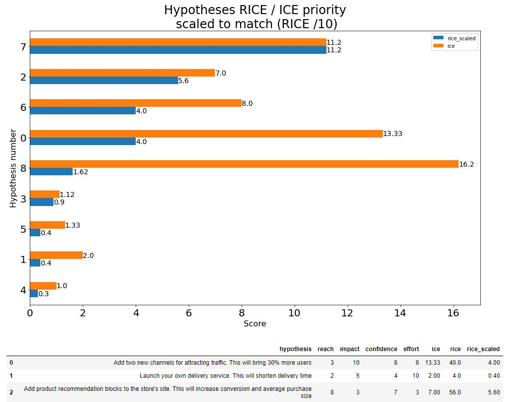
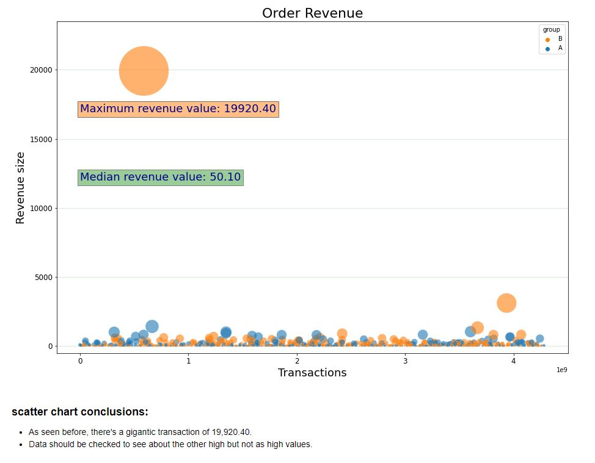
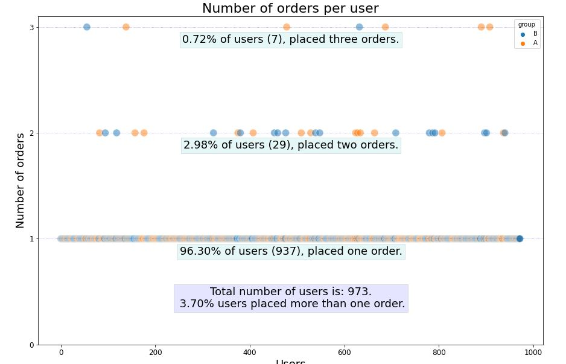

# A few graphs from the project
The full graphs and conclusions can be seen in the notebook.

### Hypotheses RICE / ICE score comparison
This graph is a comparison of RICE and ICE scores for different hypotheses (represented by numbers) 
- For an easy comparison, the RICE score is divided by 10 to match the scale of the ICE score (ICE = Impact * Confidence / Effort - MAX score of 100, and RICE = Reach * Impact * Confidence / Effort - MAX score of 1000)

---

### Order Revenue
This graph shows **Revenue from orders** during the timeline
- **dot size** represents the size of revenue per order.
- **dot color** represents the test / control groups.
- **BIG FAT outlier** is presented in the data and is hard to miss thanks to dot size
- **Text boxes** added to the plot with informations such as the median of order revenue

---

### Orders per user
This graph shows **how many orders** each user had
- It is enforced **with text boxes** displaying important information such as how many total users placed x orders and their percentage
- **dot color** represents the test / control groups.

