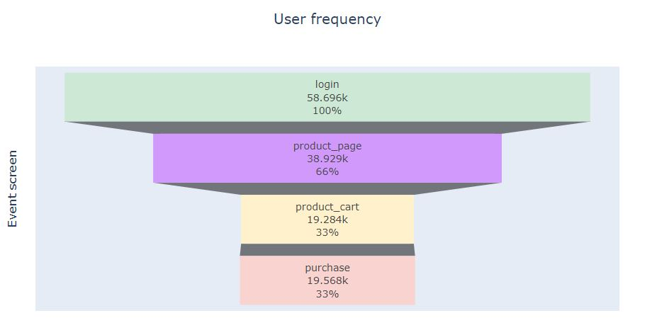
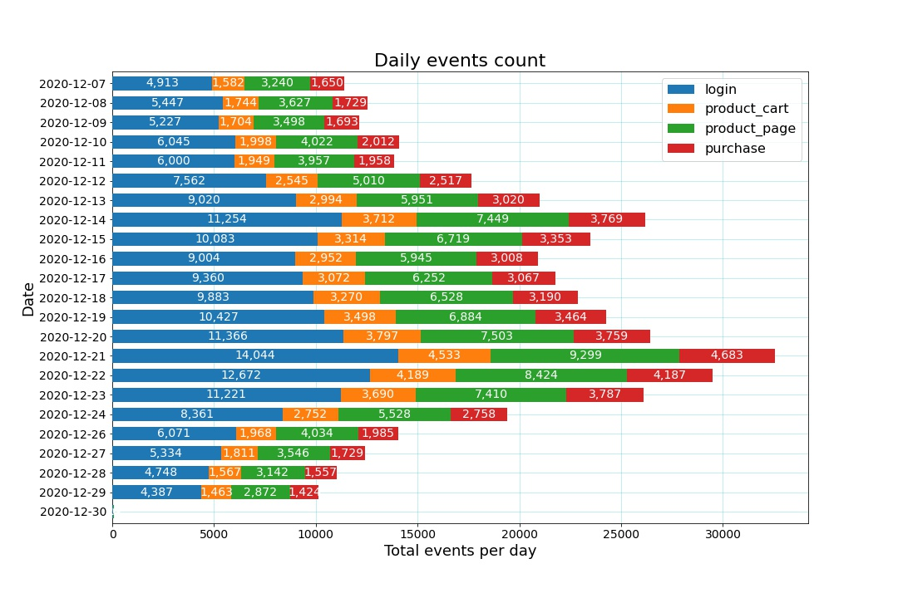
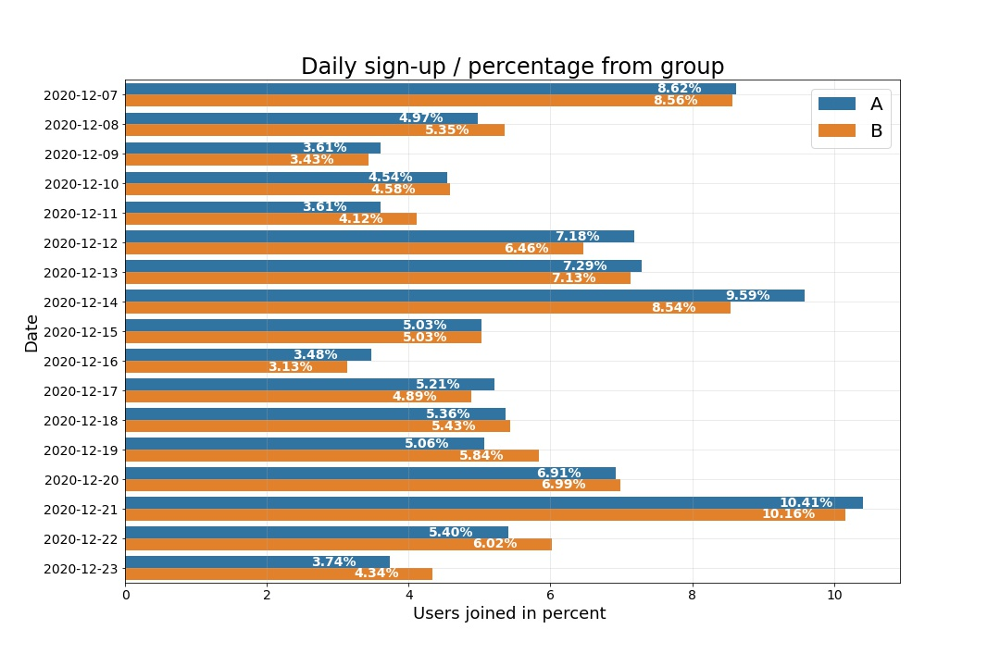

# A few graphs from the project
The full graphs and conclusions can be seen in the notebook.
### User event frequency funnel
This graph shows the **amount of users on each event screen** 

---

### Daily even count
This graph shows how many events occured on each day, broken down into event type

The stacked bars shows:
- The total sum of events.
- The sum of each event type (printed directly on the representing color on the bar.

---

---

### Daily signups per control group (percentage)
This graph shows how many users on each of the control groups signed up on each day

The percentage of users from the total users of the relevent group is printed on the bar.

