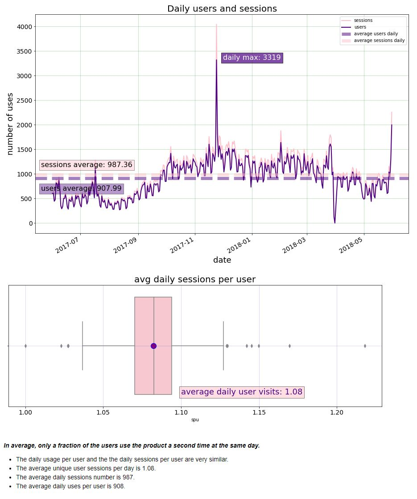
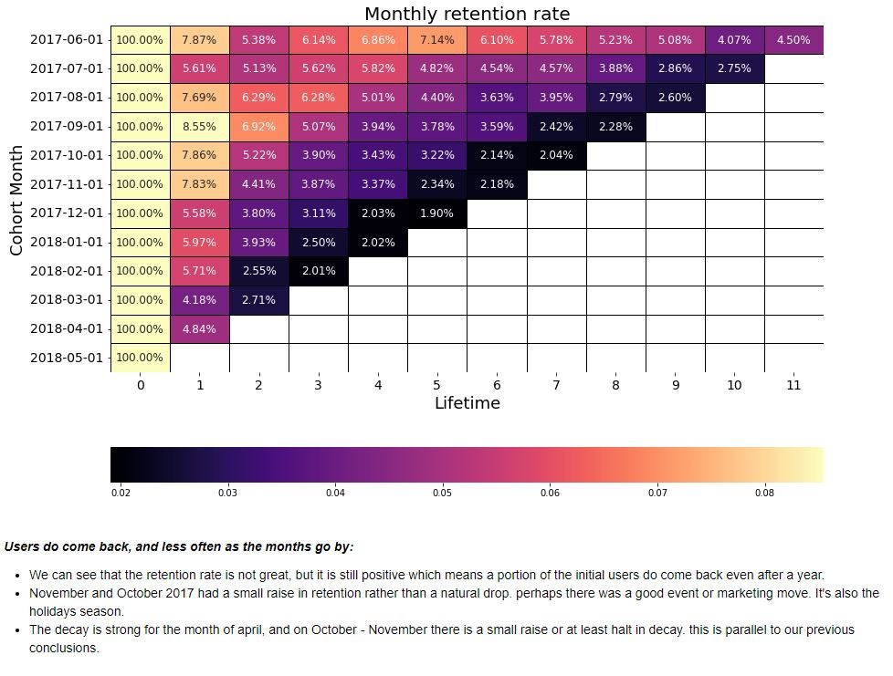
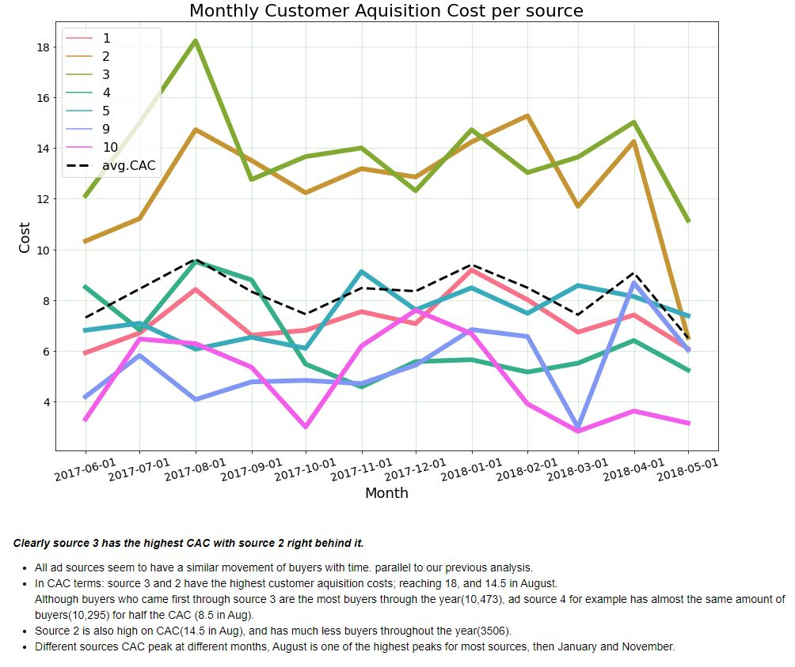

# A few graphs from the project
The full graphs and conclusions can be seen in the [notebook](https://nbviewer.org/github/cheziman/My_Projects/blob/main/Business_Analysis-Yandex_Afisha/Business_analysis-Yandex_Afisha.ipynb).

### Daily sum of Sessions / distinct Users
This graph shows the **daily sum of sessions(pink), and distinctive users(purple)**, and is backed with a boxplot.
- It is backed up with a **boxplot** since usually session number is expected to be much higher than daily users.
- **dotted lines** represent total daily averages.

---

### Monthly Cohort Retention Rate Heatmap
This graph shows the retention rate per cohort in monthly liftime.

---

### Ad sources ROMI
This is a pie showing the return on marketing investment per ad source.

---

### Monthly CAC per source
This is a lineplot showing the customer aquisition cost for each ad source.
- The black dotted line resembles the total average of all sources combined.

