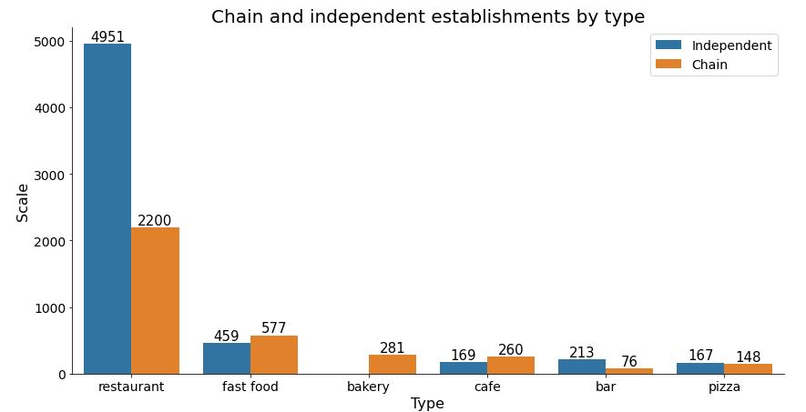
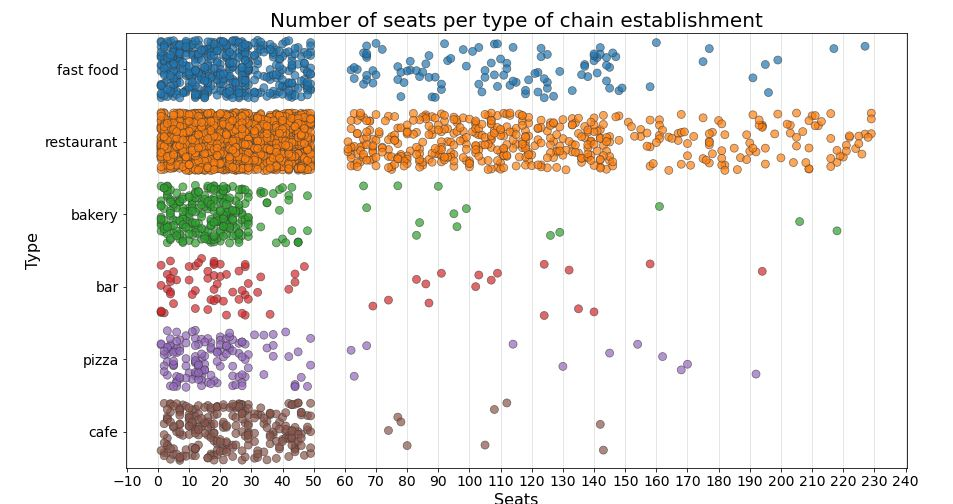
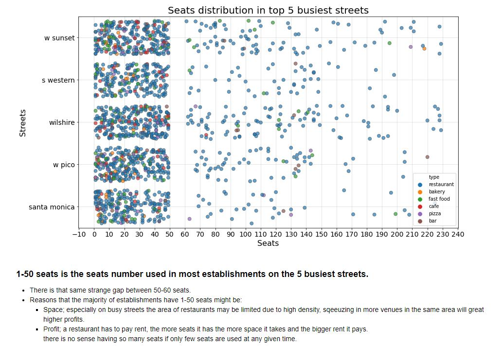
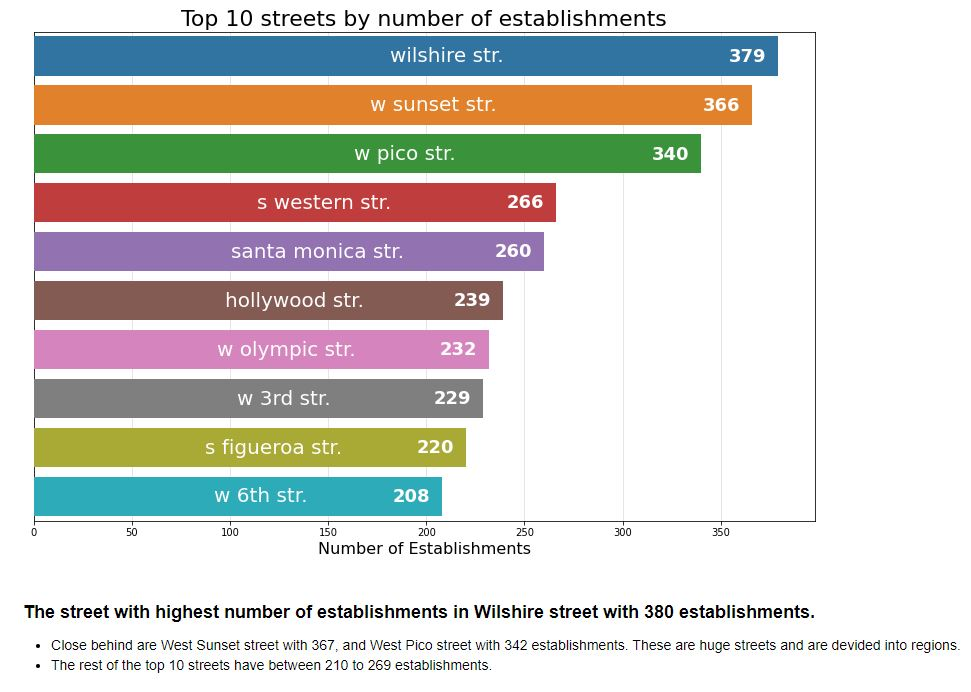

# A few graphs from the project
The full graphs and conclusions can be seen in the notebook.
### Independent vs. Chain restaurants
This graph shows the amount of independent and chain restaurants per restaurant type. notice how there are no independent bakeries?

---

### Seats per Restaurant Type
This graph shows the distribution and amount of seats in each of the restaurant types

---

### Distribution of seats per Restaurant Type in 5 busiest streets
This graph shows the amount of restaurant seats in each of the busiest streets.
- The color represents different restaurant types.
- It's interesting that there are no restaurants with 50-60 seats.

---

### Top 10 streets by number of establishments
This graph shows the 10 streets with most restaurants.

