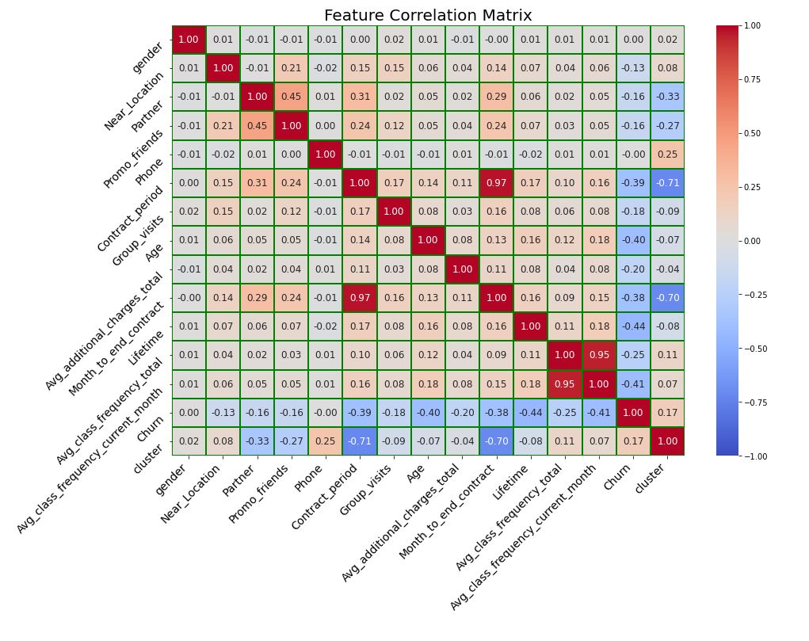
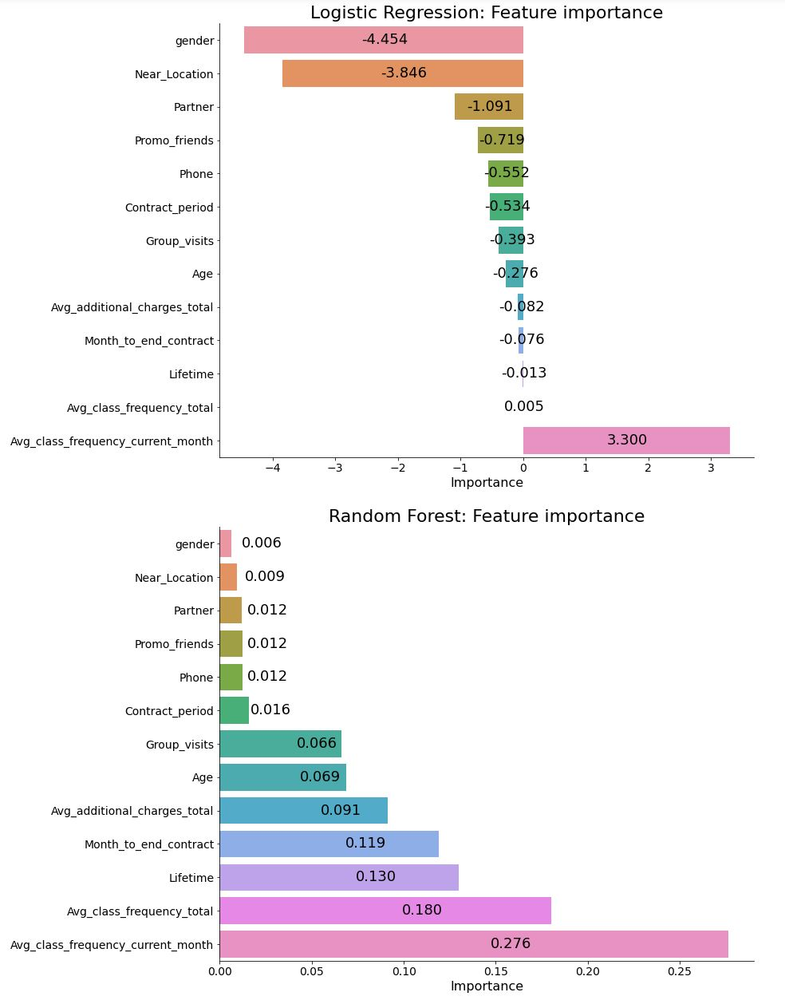
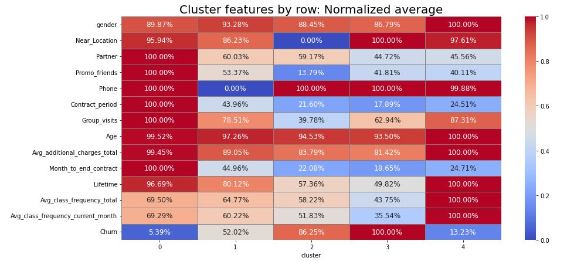
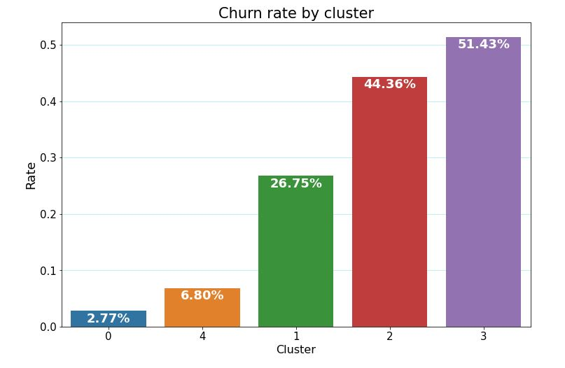

# A few graphs from the project
The full graphs and conclusions can be seen in the notebook.

---

### Feature correlation matrix heatmap
This graph shows **correlation heatmap between features**.

It *features* (pun intended) both positive and negative correlations, meaning some features have a strong effect on another feature.

---

### Feature importance - Logistic regression and random forest
This graph shows **feature importance** of the different models used in the project
- **Logistic regression** performed better than the **random forest** algorithm.
- **Feature importance** order is almost the same

---

### Cluster group features heatmap — normalized
This graph shows **normalized feature scores** per cluster, making it convinient to differentiate between the cluster groups.
- **averages calculated** between the lowest and highest value per feature for each cluster.

---

### Churn rate by cluster
This graph shows which of the cluster groups had the **highest and lowest churn rate**. Clearly if all customers were like those in group 0 it would be the most successful gym possible.

---
