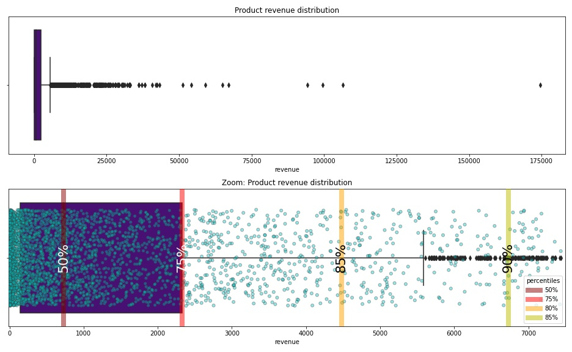
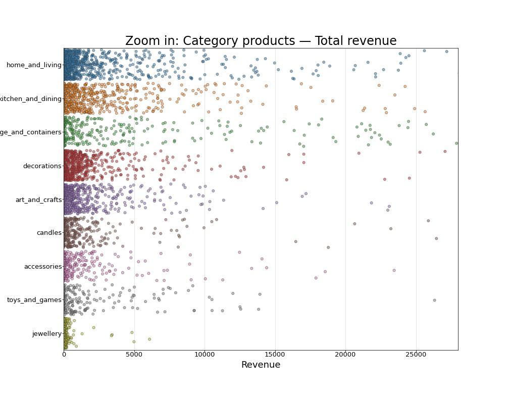

# A few graphs from the project
The full graphs and conclusions can be seen in the notebook.
### Product revenue and quantity distribution / scatterplot
This graph shows **correlation between total revenue and number of units sold** during the timeline
- **dot size** represents average revenue per unit price.
- **dot color** represents category.

---

### Product total revenue / boxplot combined with stripplot
This graph shows the distribution of total revenue per product, zooming in to get better details features:
- a normal **boxplot** showing the quartile division of product revenue.
- combined with a **stripplot** to show the actual amount of products in the total revenue distribution.
- added **precentiles** to help decide what is a "good product revenue".

---

### Product total revenue per category
This graph shows the distribution of total revenue per product, split into categories

---

### Average product revenue per category
This graph shows what is the average revenue of products in each category

