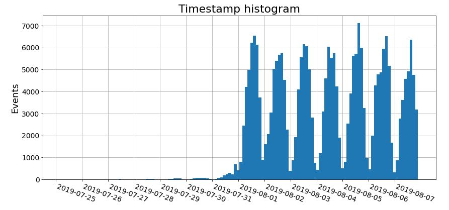
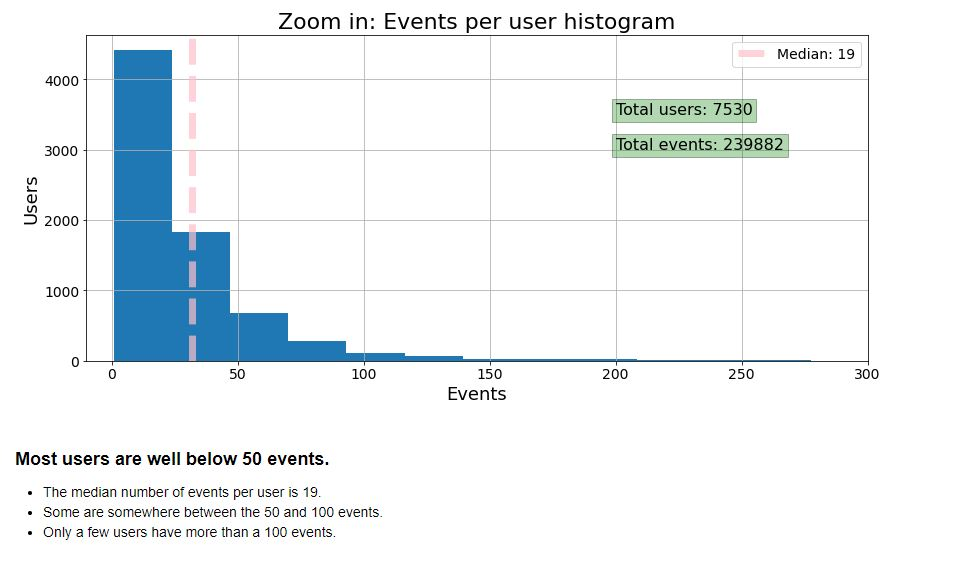

# A few graphs from the project
The full graphs and conclusions can be seen in the [notebook](https://nbviewer.org/github/cheziman/My_Projects/blob/main/User_behaviour_AAB_test/User_behaviour_AAB_testing.ipynb).

### Timestamp histogram
This graph shows **user activity frequency and distribution** during the timeline
- it's interesting to see the daily activity cycle
  - on the first enlisting week there was almost nothing as it was the preparation week.
  - Then we can see the daily cycle of peaks in the afternoon and halt in the nights every day.

---

### User event activity histogram
This graph shows the frequency and distribution of event logs per user
- The median line of how event logs per user is conviniently marked in red
- The data is left skewed which means that while most users have only several event logs, there are a few great outliers with hundrend or thousands of logs.

---

### Group event funnel
This funnel shows per test / control group the frequency of how many users interacted with each event screen
- It shows that the users in control groups are almost the same amount, and remain so in each of the event screens.
- And a big drop in users between the main event screen and the offers screen (or the rest of the screens).

